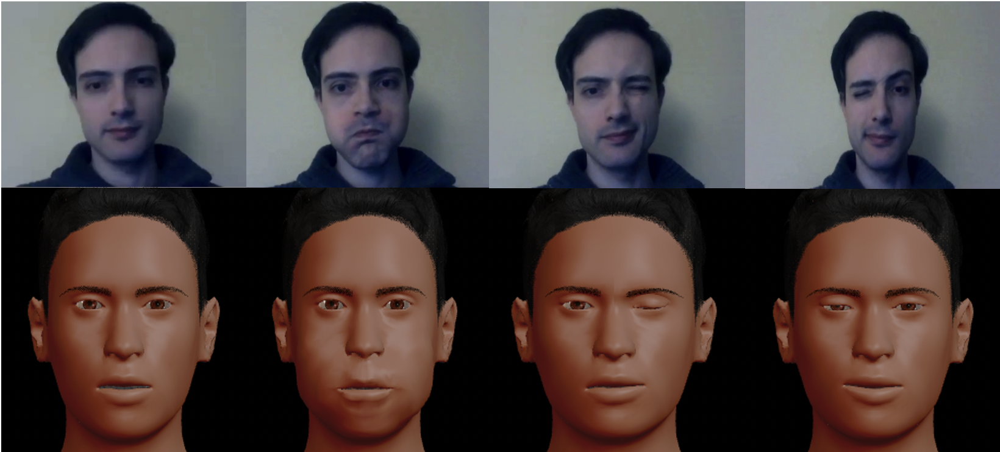

<h2 align="center">Extracting Dynamic Facial Expressions from Naturalistic Videos</h2>



### Introduction
This codebase is to infer action units activations in human facial expression videos using deep learning technique and transfer the inferred activations to generate facial expression animations in different identities. For more details, refer to this paper https://doi.org/10.31234/osf.io/wsbdq

### Custom Videos Generation
For better quality, when you generate your videos, make sure follow the 24 action units mentioned in the paper, faces are not too far from camera and no blank frames (refer to our example).

### Colab Testing
For those don't have computing resource, we have colab file (https://colab.research.google.com/drive/1jQ7vY6JVKskL_5uDr1t0UZoNI7cq8aKN#scrollTo=bv2US5cllJa7) for you to generate action units inference from your facial expression videos. You can then follow the instructions under Facial animation generation using the inference output. Make sure you upload our pretrained model weights (https://drive.google.com/file/d/1lzeO-ozXTkm29Kbny_5pekHCPdYg2FgL/view?usp=sharing) and your videos into your google drive before running the colab file.

### Prerequisites 
* CUDA (CPU for facial expression animation)
* [Nest](https://github.com/ZhouYanzhao/Nest.git)
* [Python=3.6.8](https://www.python.org)
* [PyTorch=0.4.1](https://pytorch.org) (make sure to install with cuda and torchvision)
* [Conda](https://www.anaconda.com/) (You could use Conda to install all prerequistes)
* [MakeHuman](http://www.makehumancommunity.org/)
* [FACSHuman](https://github.com/montybot/FACSHuman)
* [FFmpeg](https://www.ffmpeg.org/) (You could use conda install)

### Installation
1. Install all the prerequisities
   (Conda Version).
    ```bash
    # set up environment
    $ conda create --name face python=3.6.8
    $ conda activate face
    $ git clone https://github.com/ZhouYanzhao/Nest.git
    $ cd Nest
    $ python setup.py install
    $ cd ..
    # Install Pytorch
    $ conda install pytorch=0.4.1 cuda90 -c pytorch
    $ conda install -c pytorch torchvision
    # Install progress bar
    $ conda install -c conda-forge tqdm
    
    ```
3. Integrate FACSHuman with MakeHuman(follow the instruction: https://github.com/montybot/FACSHuman).
4. Open MakeHuman and go to Settings/Plugins to enable scripting and shell (for generating facial expression animation).

### Running our method

1. `git clone https://github.com/sccnlab/E-DFE/ ./ExtractFace`.
2. `nest module install ./ExtractFace/ s3n`. (Normally, it should work. There might be YAML version issues causing errors, refer here https://github.com/ZhouYanzhao/Nest/issues/4)
3.  Verify the installation `nest module list --filter s3n`.
4.  Install all the missed modules

#### Data
We use the facial expression data from FEAFA paper (https://www.iiplab.net/feafa/). Please download it from there if you want to use the same data.

#### Training
1. Change the data_dir in /demo/s3n_train.yml to your data folder.
2. Run `CUDA_VISIBLE_DEVICES=0,1 nest task run ./demo/s3n_train.yml`.

#### Testing
1. Change the data_dir in /demo/s3n_test.yml to your data folder.
2. You can use our pretrained model(https://drive.google.com/file/d/1lzeO-ozXTkm29Kbny_5pekHCPdYg2FgL/view?usp=sharing) and set resume in /demo/s3n_test.yml to the pretrained model.
3. Run `CUDA_VISIBLE_DEVICES=0,1 nest task run ./demo/s3n_test.yml`.
4. The code for baseline model we compared in our paper is vgg_baseline.py.

#### Prediction
1. Create you own facial expression video based on the action units referred in the paper and run `ffmpeg -i your video name  -r 30 %06d.png` to generate frames (remove all the blank frames).
2. Change the data_dir in /demo/s3n_pred.yml to your data folder.
3. You can use our pretrained model (same instruction above and set resume in /demo/s3n_pred.yml to the pretrained model).
4. Run `CUDA_VISIBLE_DEVICES=0,1 nest task run ./demo/s3n_pred.yml`.
5. The final output will save in ./output/pred.npy.

### Facial animation generation
1. Change the base in facial_animation/makehuman_face.py to your directory you want to save (output folder will have animated facial expression frames).
2. Make sure the directory in np.load is directing to your location of pred.npy.
3. In MakeHuman, go to Modeling/FACSHuman0.1 and set full face camera view.
4. Copy the facial_animation/makehuman_face.py to MakeHuman software Utilities/Scripting. For changing the identities of facial animation, [refer here](change_identities.md). 
5. Execute the code in Makehuman Utilities/Execute.
6. For better eyebrow animation, run facial_animation/combine_face.py  `python combine_face.py --input {the base directory in step 1} --output {the output folder directory you want to save to}`.
8. To generate the video, run `ffmpeg -framerate 30 -i img%03d.png -c:v libx264 -pix_fmt yuv420p out.mp4` in your final saved directory (you can set custom framerate).

# Questions
For any questions, please raise an issue on GitHub or email wangccy@bc.edu.
